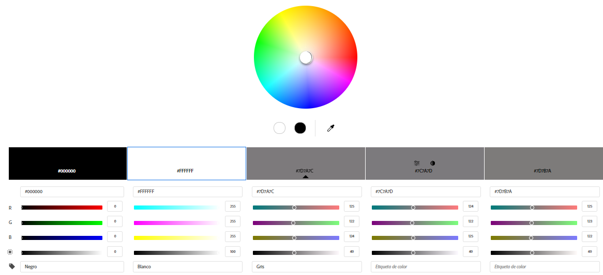

# ITech Project

## OBJETIVO
Bienvenido/a al README de nuestra empresa, dedicada a ofrecer una amplia gama de servicios en el ámbito de la tecnología. Nuestro objetivo principal es proporcionar soluciones integrales a nuestros clientes, combinando la venta online de productos informáticos, la oferta de cursos especializados en informática y la prestación de servicios de reparación de equipos.

### Nuestros Compromisos
#### Satisfacción del Cliente:

Nos esforzamos por superar las expectativas de nuestros clientes al ofrecer productos informáticos de calidad, cursos educativos actualizados y servicios de reparación eficientes.

#### Acceso a la Tecnología:

Buscamos democratizar el acceso a la tecnología mediante la venta online de productos informáticos asequibles, permitiendo que más personas se beneficien de las últimas innovaciones.

#### Desarrollo de Habilidades:

Brindamos oportunidades de aprendizaje significativas a través de nuestros cursos de informática, con el objetivo de empoderar a los individuos y fortalecer sus habilidades tecnológicas.

#### Servicio de Reparación Confiable:

Nos comprometemos a proporcionar servicios de reparación de equipos informáticos que sean rápidos, confiables y efectivos, minimizando el tiempo de inactividad para nuestros clientes.

## FUENTES

A la hora de escoger nuestras fuentes, hemos obtenido las fuentes de google Fonts, ya que tenemos un gran abanico de fuentes para escoger las más adecuadas para nuestra página. En nuestro caso, hemos escogido las siguientes fuentes:

 ### FUENTE ESCOGIDA

    - (Para titulo) Playfair Display
    - (Para cuerpo) Calibri
   
## GAMA DE COLORES

Aqui hemos elegido esta gama de colores ya que nos parece un conjunto de colores ideales para una página web.

# Negro

#000000
# Blanco

#FFFFFF
# Gris

#7B7D7D

